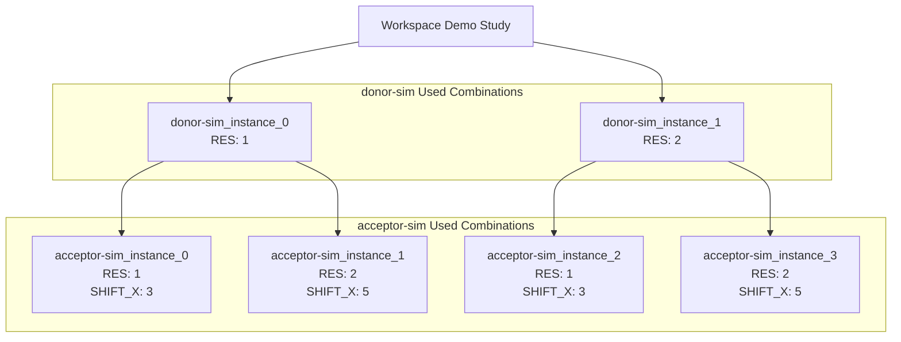
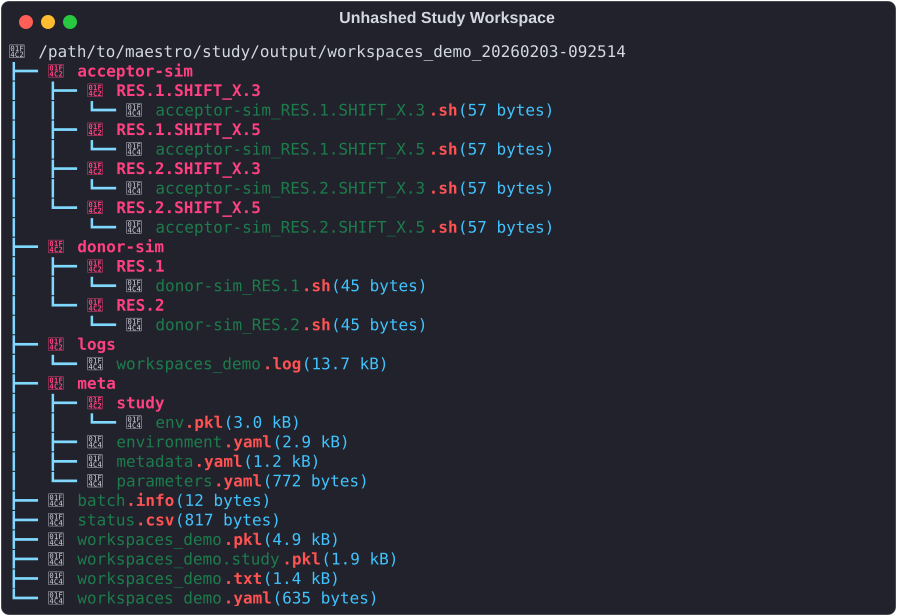
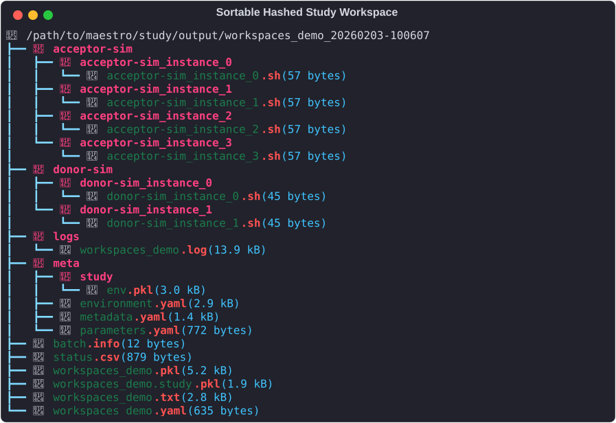

# Study Workspaces

A critical part of Maestro's design is managing study workspaces.  The motivating philosophy that your study is a computational process that you may run many data sets (parameters) through requires mechanisms for isolating those computaional experiments from eachother.  There are a few hooks on the cli and in the spec that expose control of these workspaces.

In this section we'll be working with variants of the multi-step demo spec shown below for all examples and discussion:

## Workspaces Demo Study Spec

``` yaml
description:
  name: workspaces_demo
  description: |
      Simple study used to demonstrate study and step workspace
	  behaviors

env:
  variables:
    OUTPUT_PATH: ./WORKSPACES_DEMOS # (1)

study:
  - name: donor-sim
    description: Simple step using a subset of parameters
	run:
	  cmd: |
	    echo "Used Parameters: RES: $(RES)"
		
  - name: acceptor-sim
    description: Simple step using all parameters
	run:
	  cmd: |
	    echo "Used Parameters: RES: $(RES), SHIFT_X: $(SHIFT_X)"
		
global.parameters:
  RES:
    values: [1, 1, 2, 2] # (2)
	label: RES.%%
	
  SHIFT_X:
    values: [3, 5, 3, 5] # (3)
	label: SHIFT_X.%%
```

1. Contain all instances of this study (one per `maestro run ...` call) in this directory
2. Note there are only two unique values
3. There are 2 unique values of this parameter for each unique value of the `RES` parameter, yielding a hierarchical study graph topology


## Workspaces Demo Study Topology

This workflow has the following topology:



## Study Level Workspace Controls

### OUTPUT_PATH

There is a reserved variable/token you can set in the study.env block to create the parent directory into which all experiments run via a particular study will be collected: 

``` yaml
description:
  name: workspaces_demo
  description: |
      Simple study used to demonstrate study and step workspace
	  behaviors

env:
  variables:
    OUTPUT_PATH: ./WORKSPACES_DEMOS # (1)

study:
...
```

1. Contain all instances of this study (one per `maestro run ...` call) in this directory

This `OUTPUT_PATH` is by default relative to `$(SPECROOT)`, which is the location of your study specification.  Inside of this directory Maestro will isolate each instance using the pattern `<study_name>_datetimestamp` where `<study_name>` is the description.name key in study specification.  Thus multiple repeated instances of a study can be executed simultaneously, modulo timestamp conflicts.

insert some workspace tree snapshots

### CLI

The `maestro run` command has an optional override for the OUTPUT_PATH which has different behavior than the `OUTPUT_PATH` variable in the study specification: this is meant to be the direct workspace containing the study outputs, i.e. the timestamped directory.  This means isolation between multiple study instances is the caller's responsibility.

insert example using datetime cmd on the shell to replicate study supplied output path

## Step Level Workspace Control

Additional controls are provided for the parameterized instances of steps within study's via optional hashing.  The default behavior is to use string representations of the parameter combinations (via parameter's labels, i.e. 'PARAM.%%' formatter in global.parameters) run through path sanitizer to handle spaces and other invalid path characters.  For small studies, i.e. small numbers of parameters, this works reasonably well:




Some concerns to be mindful of here is that you may want to prevent the yaml readers from treating floats as actual floats due to the extra unwanted precision that can lead to if you're using simple numbers like 0.1, etc, that cannot be exactly represented in floating point form (note: python seems to handle printing at least some of these like 0.1 well, but some numbers will break this).  As these parameters are intended to go through the shell which treats everything as strings, it can be useful to preserve the original form until the parameter reaches your application, and as a side effect keep the step workspace directory names a little more readable


Add note about path length concerns forcing the option in the next section

### Step workspace hashing

Currently the only two ways to control step workspace names are via the string typing control of floats described above, and a cli argument to the `maestro run` command: `--hashws`.

#### MD5 algorithm (pre-:material-tag:`1.1.12`)

Initial implementation simply ran the string form of the steps' parameter combination through the md5 hashing algorithm.  While this guarantees uniqueness, and limits the size of the resulting paths, it is not very human friendly:  

Insert example

#### Sortable Hash (>=:material-tag:`1.1.12`)

In Maestro :material-tag:`1.1.12`, the md5 algorithm was replaced with an alternative that's more human readable, maintaining compactness, but also introducting sortable naming.  Technically this is not a hash function as it cannot be applied to parameter combination strings independently, rather requiring knowledge of all instances of a step to apply a count based identifier.  The format of this is as follows:


| **Used Combo \#**   | **Sorted Parameter Values** | **Hashed step id/workspace** |
| :-----------:       | :---------:                 | :---------:                  |
| donor-sim used combo 0 | RES: 1                  | donor-sim_instance_0    |
| donor-sim used combo 1 | RES: 2                  | donor-sim_instance_1    |
| acceptor-sim used combo 0 | RES: 1, SHIFT_X: 3      | acceptor-sim_instance_0    |
| acceptor-sim used combo 1 | RES: 1, SHIFT_X: 5      | acceptor-sim_instance_1    |
| acceptor-sim used combo 2 | RES: 2, SHIFT_X: 3      | acceptor-sim_instance_2    |
| acceptor-sim used combo 3 | RES: 2, SHIFT_X: 5      | acceptor-sim_instance_3    |

The naming follows the behavior of Maestro's parameter based graph construction, where for parameterized steps, Maestro generates one instance of that step for each unique set of values for the parameters used by that step.  The resulting study workspace then becomes:



<!-- TODO: insert link to MEPS when they are published with changelog section -->
